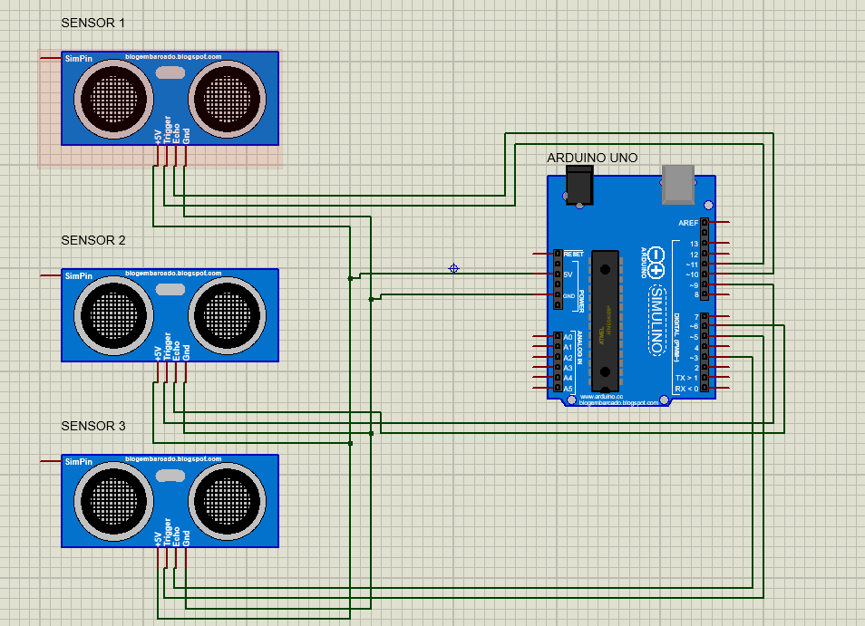
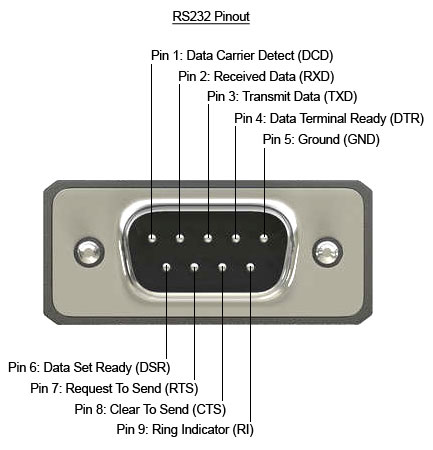
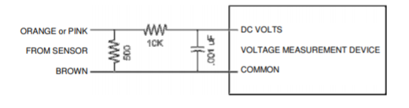
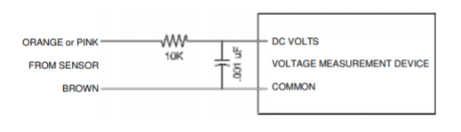

# LASER DISTANCE SENSORS
Interfacing The Laser Distance Sensors and enabling Serial communication between the sensor and Arduino or Raspberry Pi.

## Trial with 3 Ultrasonic Sensors
In the file [Arduino01.ino](https://github.com/meghang-101/Meghang-IC-Internship-Submissions/blob/LaserDistance/Arduino01.ino), you will find the source code for interfacing the sensor to Arduino

In the file [rasp001.py](https://github.com/meghang-101/Meghang-IC-Internship-Submissions/blob/LaserDistance/rasp001.py), you will find the source code for interfacing the sensor to Raspberry Pi.

In the file [IC laser sensor to arduino.pdsprj](https://github.com/meghang-101/Meghang-IC-Internship-Submissions/blob/LaserDistance/IC%20laser%20sensor%20to%20arduino.pdsprj), you will find the Proteus design file for interfacing the sensor to Arduino. Similar interfacing is done with the Raspberry Pi.

## Interfacing AR200 Laser Distance Sensor
When it comes to Laser Sensors, the output pinout of every sensor varies. In the case of the AR200, the output pinout is in the form of RS-232-Output which has a functioning TX-Data pinout and RX-Data pinoutm and a GND port.

## ANALOG OUTPUT MODES
Orange and Brown lines in the signal cable carry the analog signals. The folllowing are the output protocols followed.

### CURRENT LOOP OUTPUT
In 4-20mA analog mode, the analog lines will deliver a current which increases linearly from 4 mA at the zero point to 20 mA at the span point. 

The Serial communication can be achieved and calibrated from the current loop value to the equivalent distance value.

### VOLTAGE OUTPUT
In 0-10V voltage mode, the analog lines will deliver a voltage which increases linearly from 0V at the zero point to 10V at the span point. 

The Serial communication can be achieved and calibrated from the output voltage value to the equivalent distance value.

## RS232 and TTL
Most of the Industrial grade sensors have a RS232 output. So Serial communication with Arduino or Raspberry Pi will only be possible with RS232 output. Since the output voltage ranges to +/-13V, it is not possible to interface the RS232 directly to the Arduino or Raspberry Pi. Thus, we need a RS232 to TTL converter shield. The TTL output ranges from 3.3V to 5V.

The whole system would look something like this:

In this design, the right side headers are connected directly to the RS232 output from the Laser Sensor. Then, the outputs are feeded to their respective ports on a RS232-TTL converter shield. The output from the TTL is directly interfaced with the Arduino. The TTl output has a RXT and TXT output which is directly connected to the TXT and RXT port of the Arduino respectively.
